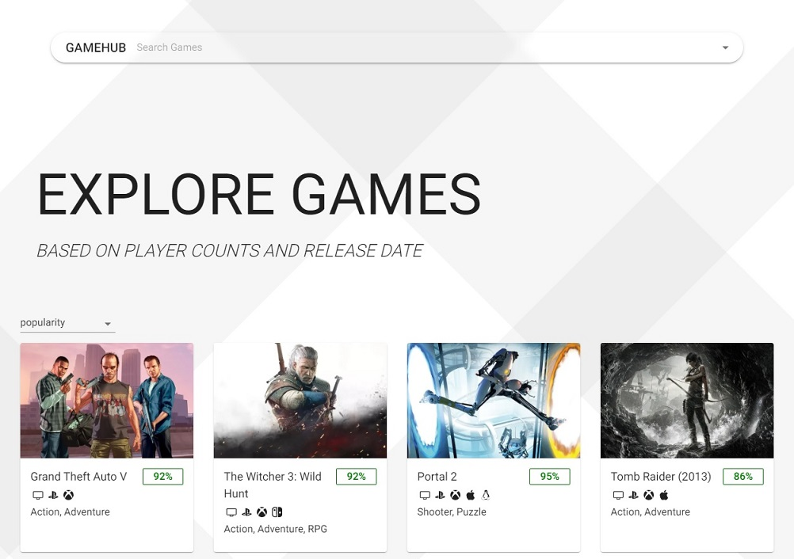
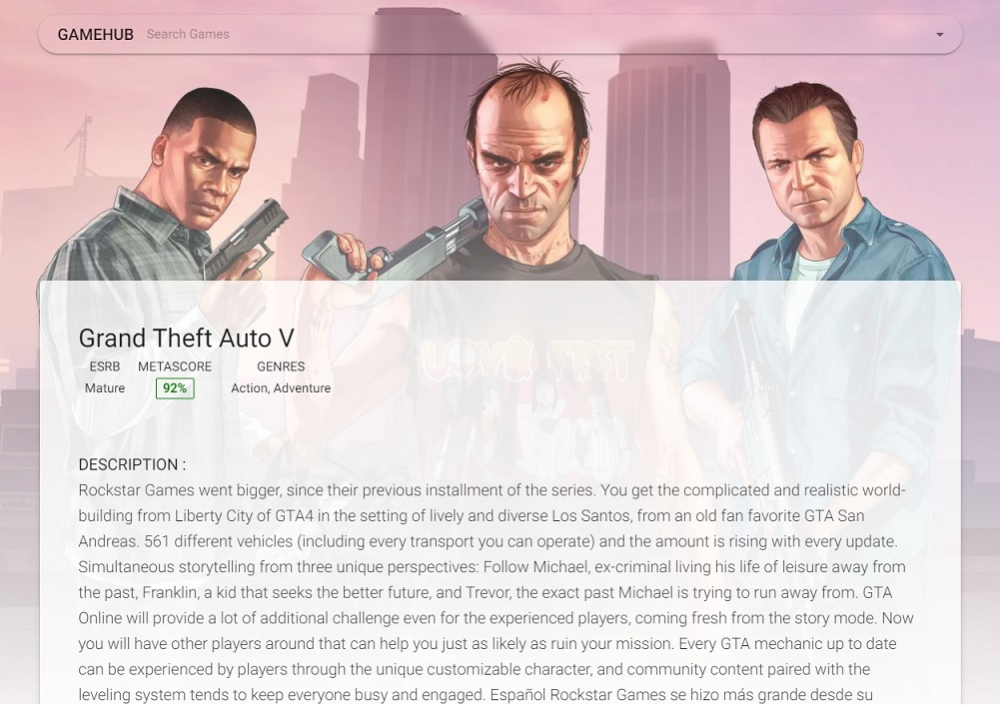
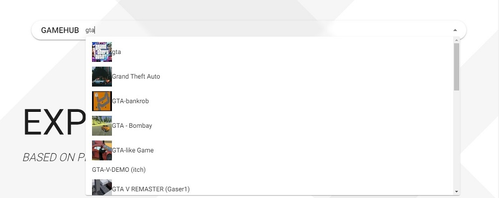

# Gamehub

## Project description

client and server typescript based app Built on top of Nx monorepo

## Technologies used

- [Nx Monorepo](https://nx.dev/)
- [NestJS](https://nestjs.com/)
- [NextJS](https://nextjs.org/)
- [Typescript](https://www.typescriptlang.org/)
- [Apollo GraphQL](https://www.apollographql.com/)
- [Styled Components](https://https://mui.com/)
- [RAWG API](https://rawg.io/apidocs)

## Screenshots

### index page

### game detail page

### auto complete search

